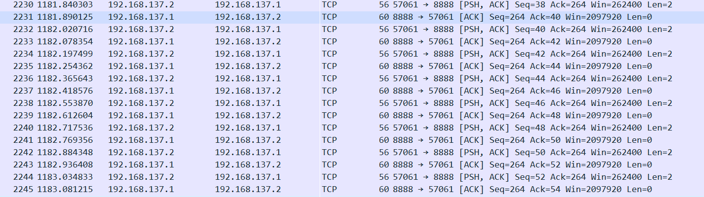
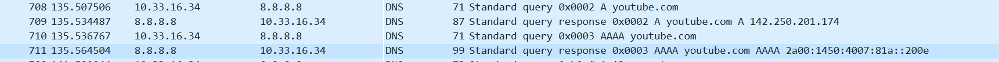

# TP1 - Premier pas réseau

# I. Exploration locale en solo

## 1. Affichage d'informations sur la pile TCP/IP locale

**🌞 Affichez les infos des cartes réseau de votre PC**
### carte interface wifi :
```
  Suffixe DNS propre à la connexion. . . :
   Description. . . . . . . . . . . . . . : Intel(R) Wi-Fi 6 AX201 160MHz
   Adresse physique . . . . . . . . . . . : 38-87-D5-34-43-DD
   Adresse IPv4. . . . . . . . . . . . . .: 10.33.16.99(préféré)
   Passerelle par défaut. . . . . . . . . : 10.33.19.254
   ```
### carte interface ethernet :
```
   Description. . . . . . . . . . . . . . : Realtek PCIe GbE Family Controller
   Adresse physique . . . . . . . . . . . : 48-9E-BD-4E-44-F4
   ```

**🌞 Affichez votre gateway**
```
   Passerelle par défaut. . . . . . . . . : 10.33.19.254
```
**🌞 Déterminer la MAC de la passerelle**
```
PS C:\Users\Utilisateur> arp -a 10.33.19.254

Interface : 10.33.16.99 --- 0x6
  Adresse Internet      Adresse physique      Type
  10.33.19.254          00-c0-e7-e0-04-4e     dynamique
```

### En graphique (GUI : Graphical User Interface)

**🌞 Trouvez comment afficher les informations sur une carte IP (change selon l'OS)**

En utilisant l'interface graphique de votre OS :  
- touche windows
- recherche "informations système"
- composant
- reseau
- carte

## 2. Modifications des informations

### A. Modification d'adresse IP (part 1)  

🌞 Utilisez l'interface graphique de votre OS pour **changer d'adresse IP** :
- paramètres
- réseau et internet
- etat
- modifier les options d'adaptateur
- propriété
- protocole internet version 4

🌞 **Il est possible que vous perdiez l'accès internet.** \
Connexion perdue, l'adresse ipv4 mise manuellement doit être déjà prise.

# II. Exploration locale en duo

## 3. Modification d'adresse IP

🌞 **Modifiez l'IP des deux machines pour qu'elles soient dans le même réseau**

- paramètres
- réseau et internet
- etat
- modifier les options d'adaptateur
- propriété
- protocole internet version 4

🌞 **Vérifier à l'aide d'une commande que votre IP a bien été changée**
```
Carte Ethernet Ethernet 2 :
   Suffixe DNS propre à la connexion. . . :
   Description. . . . . . . . . . . . . . : Realtek PCIe GbE Family Controller
   Adresse physique . . . . . . . . . . . : 48-9E-BD-4E-44-F4
   DHCP activé. . . . . . . . . . . . . . : Non
   Configuration automatique activée. . . : Oui
   Adresse IPv6 de liaison locale. . . . .: fe80::1805:dfff:b745:8fc6%21(préféré)
   Adresse IPv4. . . . . . . . . . . . . .: 10.10.10.1(préféré)
   Masque de sous-réseau. . . . . . . . . : 255.255.255.0
   Passerelle par défaut. . . . . . . . . :
```
🌞 **Vérifier que les deux machines se joignent**
```
PS C:\Users\Utilisateur> ping 10.10.10.6

Envoi d’une requête 'Ping'  10.10.10.6 avec 32 octets de données :
Réponse de 10.10.10.6 : octets=32 temps=2 ms TTL=128
Réponse de 10.10.10.6 : octets=32 temps=3 ms TTL=128
Réponse de 10.10.10.6 : octets=32 temps=2 ms TTL=128
Réponse de 10.10.10.6 : octets=32 temps=2 ms TTL=128

Statistiques Ping pour 10.10.10.6:
    Paquets : envoyés = 4, reçus = 4, perdus = 0 (perte 0%),
Durée approximative des boucles en millisecondes :
    Minimum = 2ms, Maximum = 3ms, Moyenne = 2ms
```

🌞 **Déterminer l'adresse MAC de votre correspondant**
```
PS C:\Users\Utilisateur> arp -a 10.10.10.6

Interface : 10.10.10.1 --- 0x15
  Adresse Internet      Adresse physique      Type
  10.10.10.6            08-8f-c3-52-58-34     dynamique
```

## 4. Utilisation d'un des deux comme gateway


🌞**Tester l'accès internet**
```
PS C:\Users\Utilisateur> ping 1.1.1.1

Envoi d’une requête 'Ping'  1.1.1.1 avec 32 octets de données :
Réponse de 1.1.1.1 : octets=32 temps=26 ms TTL=54
Réponse de 1.1.1.1 : octets=32 temps=23 ms TTL=54

Statistiques Ping pour 1.1.1.1:
    Paquets : envoyés = 2, reçus = 2, perdus = 0 (perte 0%),
Durée approximative des boucles en millisecondes :
    Minimum = 23ms, Maximum = 26ms, Moyenne = 24ms
```

🌞 **Prouver que la connexion Internet passe bien par l'autre PC**
```
PS C:\Users\Utilisateur> tracert google.com

Détermination de l’itinéraire vers google.com [142.250.75.238]
avec un maximum de 30 sauts :

  1     1 ms     1 ms     1 ms  kzenoo [192.168.137.1]
  2     *        *        *     Délai d’attente de la demande dépassé.
  3     5 ms     6 ms     5 ms  10.33.19.254
```

## 5. Petit chat privé

🌞 **sur le PC *serveur*** avec par exemple l'IP 192.168.1.1

```
C:\netcat\netcat-1.11> .\nc.exe -l -p 8888
hello
salut
how are you ajd
ca va
```

🌞 **sur le PC *client*** avec par exemple l'IP 192.168.1.2
```
PS C:\Users\Utilisateur\Documents\B1_info\fonction_reseau\netcat-1.11> .\nc.exe 192.168.137.1 8888
hello
salut
ca va
```

🌞 **Visualiser la connexion en cours**

```
PS C:\Windows\system32> netstat -a -n -b | Select-String 8888

  TCP    192.168.137.1:8888     192.168.137.2:62178    ESTABLISHED

 ```

🌞 **Pour aller un peu plus loin**

```

PS C:\Windows\system32> netstat -a -n -b | Select-String 8888

  TCP    0.0.0.0:8888           0.0.0.0:0              LISTENING


PS C:\Windows\system32> netstat -a -n -b | Select-String 8888

  TCP    192.168.137.1:8888     0.0.0.0:0              LISTENING
 ```
## 6. Firewall

🌞 **Activez et configurez votre firewall**

- autoriser les `ping`
```
PS C:\Windows\system32> netsh advfirewall firewall add rule name="ICMP Allow incoming V4 echo request" protocol=icmpv4:8,any dir=in action=allow
Ok.
```
```
PS C:\Users\Utilisateur\Documents\B1_info\fonction_reseau\netcat-1.11> ping 192.168.137.1

Envoi d’une requête 'Ping'  192.168.137.1 avec 32 octets de données :
Réponse de 192.168.137.1 : octets=32 temps=4 ms TTL=128
Réponse de 192.168.137.1 : octets=32 temps=3 ms TTL=128
Réponse de 192.168.137.1 : octets=32 temps=3 ms TTL=128
Réponse de 192.168.137.1 : octets=32 temps=3 ms TTL=128

    Paquets : envoyés = 4, reçus = 4, perdus = 0 (perte 0%),
    Minimum = 3ms, Maximum = 4ms, Moyenne = 3ms
```

- autoriser le traffic sur le port qu'utilise \
  -> pare-feu Windows defender avec fonctions avancées de sécurité \
 -> règles de trafic entrant \
 -> nouvelle règle \
 -> port \
 -> TCP et ports locaux spécifiques : 8888 \
 -> autoriser la connexion \
 -> domaine + privé + public \
 -> nom de la règle : " port 8888 ouvert"

 ```
 PS C:\Users\Utilisateur\Documents\B1_info\fonction_reseau\netcat-1.11> .\nc.exe 192.168.137.1 8888
hello
coucou
```
  
# III. Manipulations d'autres outils/protocoles côté client

## 1. DHCP


🌞**Exploration du DHCP, depuis votre PC**
```
Carte réseau sans fil Wi-Fi :

   Suffixe DNS propre à la connexion. . . :
   Description. . . . . . . . . . . . . . : Intel(R) Wi-Fi 6 AX201 160MHz
   Adresse physique . . . . . . . . . . . : 38-87-D5-34-43-DD
   DHCP activé. . . . . . . . . . . . . . : Oui
   Bail obtenu. . . . . . . . . . . . . . : mercredi 5 octobre 2022 11:25:31
   Bail expirant. . . . . . . . . . . . . : jeudi 6 octobre 2022 08:54:25
   Passerelle par défaut. . . . . . . . . : 10.33.19.254
   Serveur DHCP . . . . . . . . . . . . . : 10.33.19.254
```
## 2. DNS

🌞** Trouver l'adresse IP du serveur DNS que connaît votre ordinateur**
```
   Serveurs DNS. . .  . . . . . . . . . . : 8.8.8.8
                                       8.8.4.4
                                       1.1.1.1
```
🌞 Utiliser, en ligne de commande l'outil `nslookup` (Windows, MacOS) ou `dig` (GNU/Linux, MacOS) pour faire des requêtes DNS à la main

- faites un *lookup* (*lookup* = "dis moi à quelle IP se trouve tel nom de domaine")
  - pour `google.com`

```
PS C:\Users\Utilisateur\Documents\B1_info\fonction_reseau\netcat-1.11> nslookup google.com
Serveur :   dns.google
Address:  8.8.8.8

Réponse ne faisant pas autorité :
Nom :    google.com
Addresses:  2a00:1450:4007:813::200e
          216.58.215.46
```
  - pour `ynov.com`
```
PS C:\Users\Utilisateur\Documents\B1_info\fonction_reseau\netcat-1.11> nslookup ynov.com

Serveur :   dns.google
Address:  8.8.8.8

Réponse ne faisant pas autorité :
Nom :    ynov.com
Addresses:  2606:4700:20::681a:ae9
          2606:4700:20::ac43:4ae2
          2606:4700:20::681a:be9
          104.26.10.233
          172.67.74.226
          104.26.11.233
```

  - interpréter les résultats de ces commandes : \
  La commande renvoit l'ip correspondant au nom de domaine donné.

- déterminer l'adresse IP du serveur à qui vous venez d'effectuer ces requêtes : \
8.8.8.8

- faites un *reverse lookup* (= "dis moi si tu connais un nom de domaine pour telle IP")
  - pour l'adresse `78.73.21.21`
```
PS C:\Users\Utilisateur> nslookup 78.73.21.21
Serveur :   dns.google
Address:  8.8.8.8

Nom :    78-73-21-21-no168.tbcn.telia.com
Address:  78.73.21.21
```
  - pour l'adresse `22.146.54.58`
```
PS C:\Users\Utilisateur> nslookup 22.146.54.58
Serveur :   dns.google
Address:  8.8.8.8

*** dns.google ne parvient pas à trouver 22.146.54.58 : Non-existent domain
```
  - interpréter les résultats : \
   La commande renvoit le nom de domaine correspondant à l'adresse ip donnée.

# IV. Wireshark

🌞 Utilisez le pour observer les trames qui circulent entre vos deux carte Ethernet. Mettez en évidence :

- un `netcat` entre vous et votre mate, branché en RJ45



- une requête DNS. Identifiez dans la capture le serveur DNS à qui vous posez la question.



🌞 **Wireshark it**

- déterminez à quelle IP et quel port votre PC se connecte quand vous regardez une vidéo Youtube


